# Udacity Cloud Native Architecture - Project 3 - Building a Metrics Dashboard

## Verify the monitoring installation

*TODO:* run `kubectl` command to show the running pods and services for all components. Take a screenshot of the output and include it here to verify the installation
### Setup Prometheus and Grafana on Kubernetes using prometheus-operator
I have used prometheus-operator based on [this guide](https://computingforgeeks.com/setup-prometheus-and-grafana-on-kubernetes/) to setup Prometheus and Grafana. 

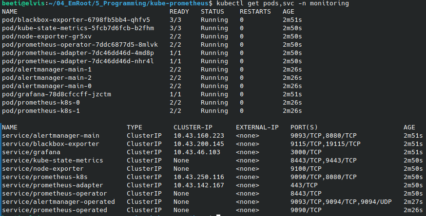

### Setup Jaeger Operator and Instance
The instructions from the course did not work anymore. Therefore I used the official [Jaeger Operator for Kubernetes](https://github.com/jaegertracing/jaeger-operator) instructions. 

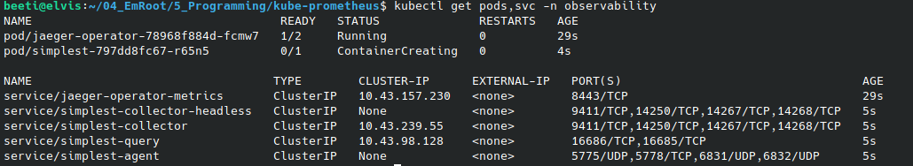


## Setup the Jaeger and Prometheus source
*TODO:* Expose Grafana to the internet and then setup Prometheus as a data source. Provide a screenshot of the home page after logging into Grafana.
### Accessing Prometheus UI and Grafana 
``` shell
# Access Prometheus
kubectl --namespace monitoring port-forward svc/prometheus-k8s 9090

# Access Alertmanager
kubectl --namespace monitoring port-forward svc/alertmanager-main 9093

# Access Grafana
kubectl --namespace monitoring port-forward svc/grafana 3000
```

### Grafana Homepage
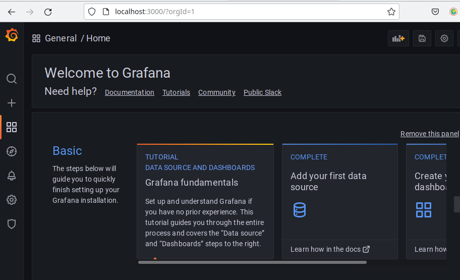


## Create a Basic Dashboard
*TODO:* Create a dashboard in Grafana that shows Prometheus as a source. Take a screenshot and include it here.

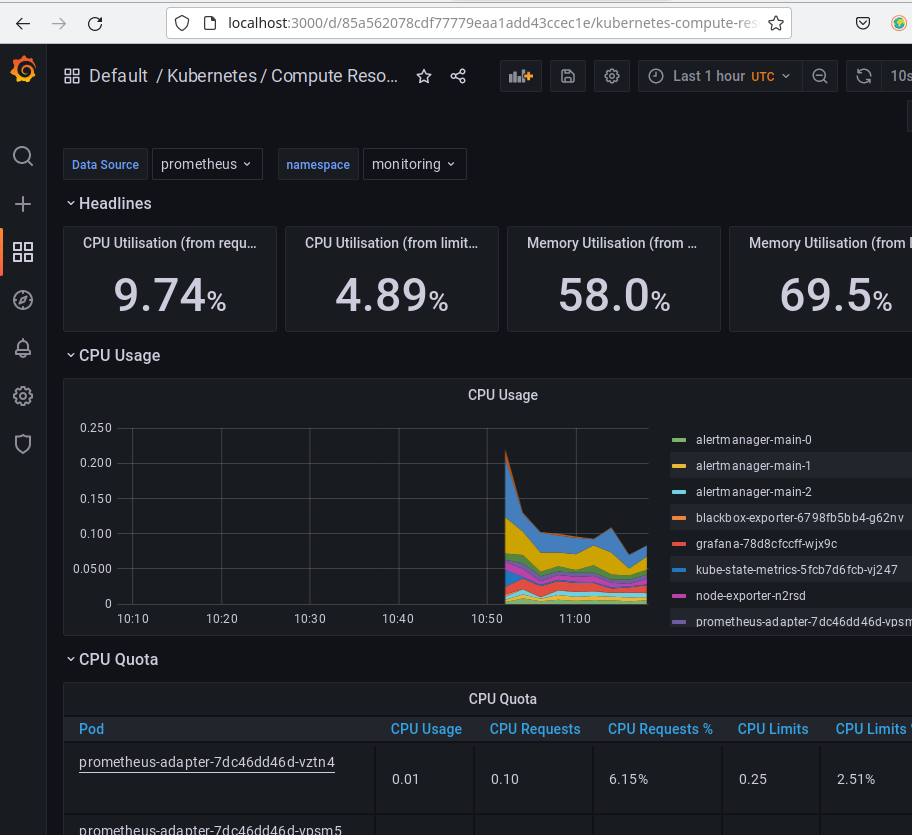

## Describe SLO/SLI
*TODO:* Describe, in your own words, what the SLIs are, based on an SLO of *monthly uptime* and *request response time*.
### In general
Service Level Indicators (SLIs) are needed to measure how well a system or application is performing in regards to a specific Service Level Objective (SLO).
### SLI for monthly uptime
E.g.: The uptime (availability) of the service was 99.7% in October 2021.
### SLIs for request response time
E.g.: The average response time for a request in October 2021 has been 400ms.

## Creating SLI metrics.
*TODO:* It is important to know why we want to measure certain metrics for our customer. Describe in detail 5 metrics to measure these SLIs. 

+ The uptime of the application last month was 99.5%
+ The average response time last month has been 154ms.
+ Less than 1% of http requests had a 50x response during last month.
+ The overall number of http requests has been above 10k requests during last month.
+ The peak memory usage of the system has been below 80% of total available memory during last month.

## Create a Dashboard to measure our SLIs
*TODO:* Create a dashboard to measure the uptime of the frontend and backend services We will also want to measure to measure 40x and 50x errors. Create a dashboard that show these values over a 24 hour period and take a screenshot.

### Dashboard with uptime and number of errors

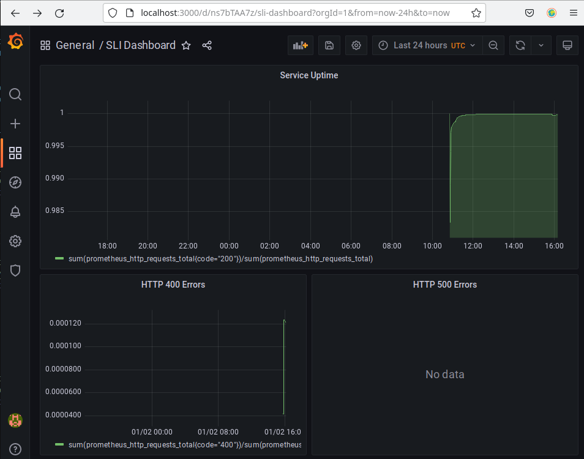

## Tracing our Flask App
*TODO:*  We will create a Jaeger span to measure the processes on the backend. Once you fill in the span, provide a screenshot of it here. Also provide a (screenshot) sample Python file containing a trace and span code used to perform Jaeger traces on the backend service.

### Jaeger Span
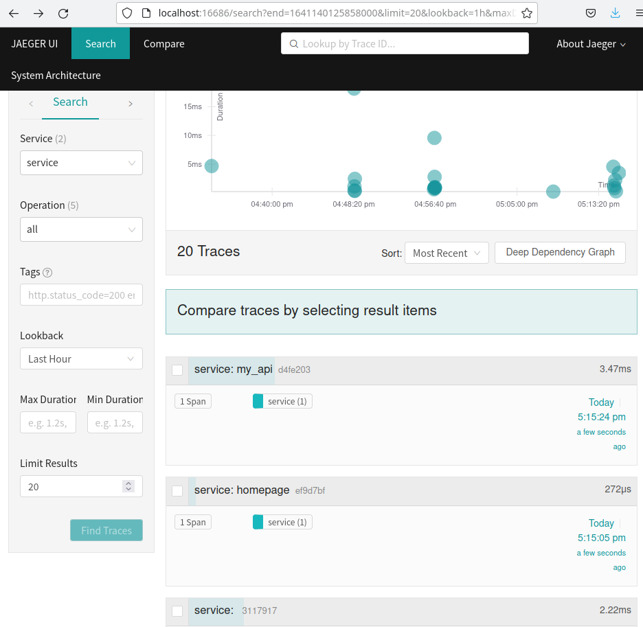

### Python Code for Jaeger

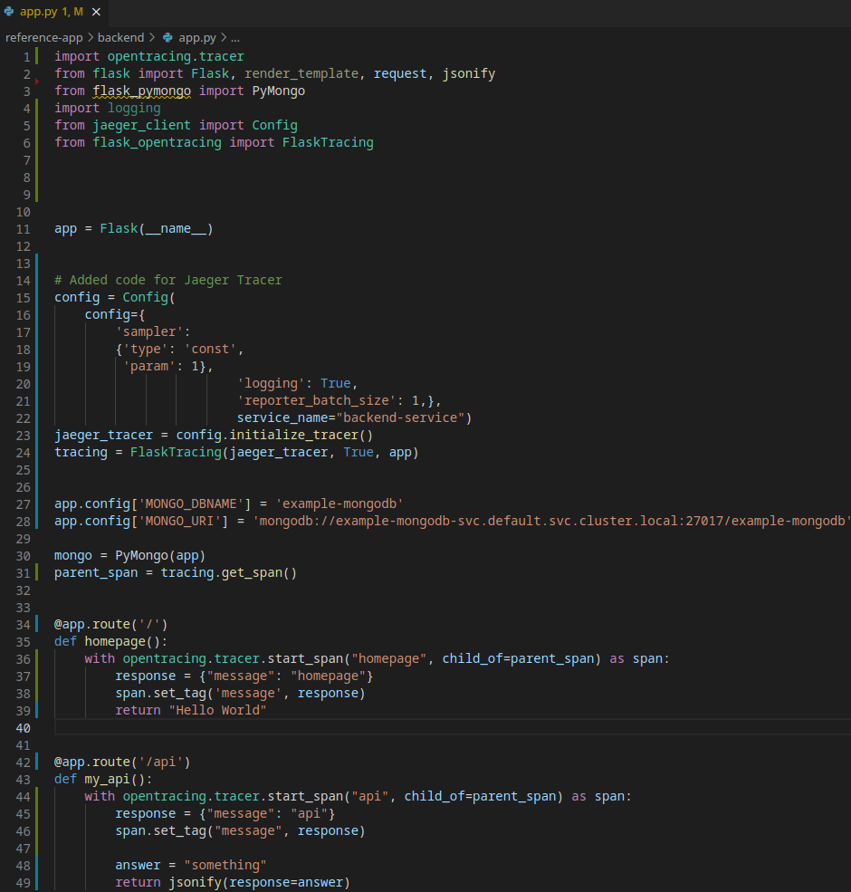

## Jaeger in Dashboards
*TODO:* Now that the trace is running, let's add the metric to our current Grafana dashboard. Once this is completed, provide a screenshot of it here.

### Jaeger metric in Grafana
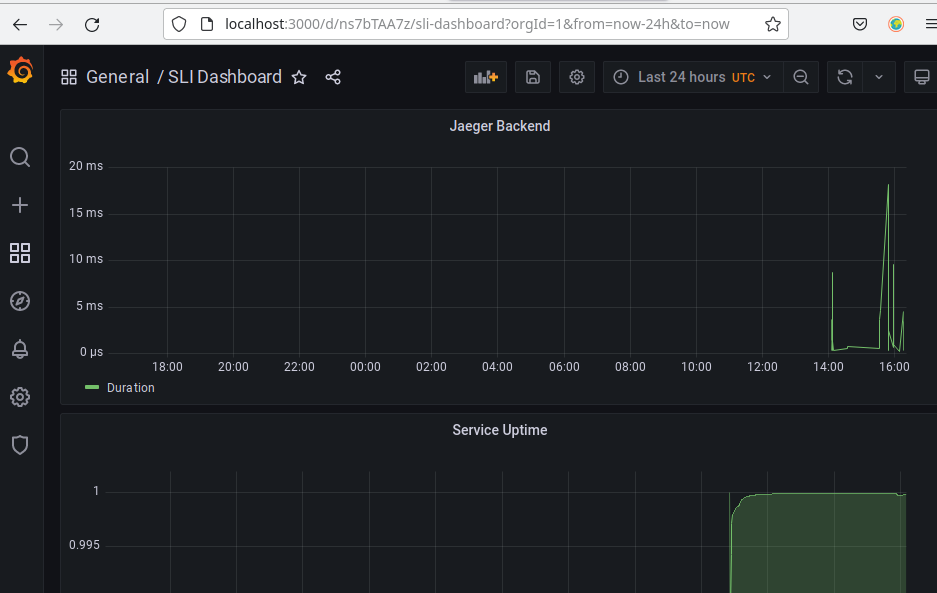

## Report Error
*TODO:* Using the template below, write a trouble ticket for the developers, to explain the errors that you are seeing (400, 500, latency) and to let them know the file that is causing the issue also include a screenshot of the tracer span to demonstrate how we can user a tracer to locate errors easily.

TROUBLE TICKET

Name: Max Mustermann

Date: Jan 2; 17:23

Subject: HTTP 405 Error ("Method Not Allowed") at http://localhost:5050/star

Affected Area: Backend Service; Endpoint /star

Severity: Critical

Description: The backend service does not provide the expected results. Please refer to tracer span 3994b5b for more details.

### Screenshot of the Tracer span

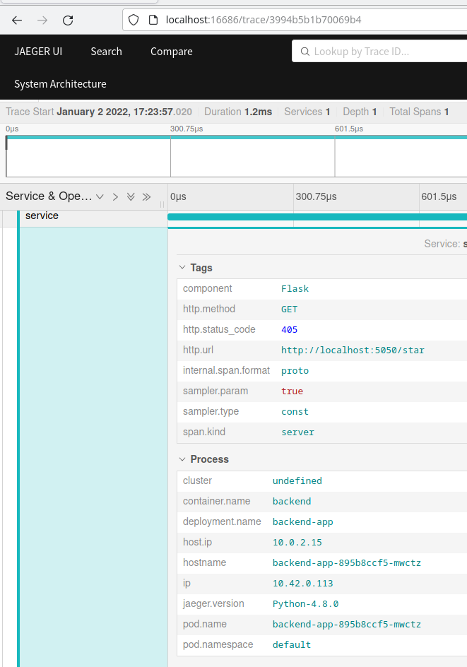

## Creating SLIs and SLOs
*TODO:* We want to create an SLO guaranteeing that our application has a 99.95% uptime per month. Name four SLIs that you would use to measure the success of this SLO.

### SLIs to measure the desired SLO
1. The average CPU usage in December is 15%.
2. The average Memory usage in December is 450MB.
3. The average response time in December is 800ms.
4. The error rate in December is 1.4%

sum(rate(http_request_duration_seconds_sum[5m])) / sum(rate(http_request_duration_seconds_count[5m]))

## Building KPIs for our plan
*TODO*: Now that we have our SLIs and SLOs, create a list of 2-3 KPIs to accurately measure these metrics as well as a description of why those KPIs were chosen. We will make a dashboard for this, but first write them down here.

  * CPU usage
      * Average CPU usage of the Cluster
      * Average CPU usage of the backend service
      * Average CPU usage of the frontend service
  * Memory usage
      * Average memory used by the Cluster
      * Average memory used by the backend pods
      * Average memory used by the frontend pods
  * Response time
      * Average response time of the Cluster monitored in 1 min time frames.
      * Average response time of the Cluster monitored in 15 min time frames.
  * Error rate
      * Requests with 40x errors compared to all requests
      * Requests with 200 status code compared to all requests

## Final Dashboard
*TODO*: Create a Dashboard containing graphs that capture all the metrics of your KPIs and adequately representing your SLIs and SLOs. Include a screenshot of the dashboard here, and write a text description of what graphs are represented in the dashboard.

### Screenshots from the final dashboard
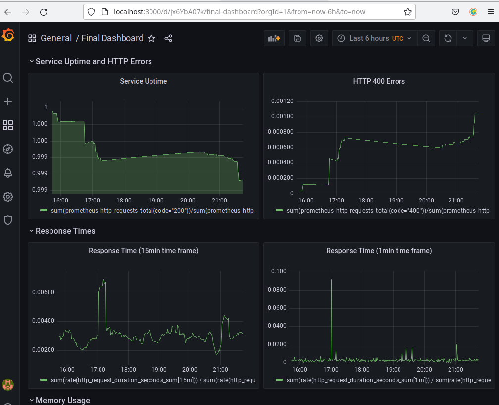


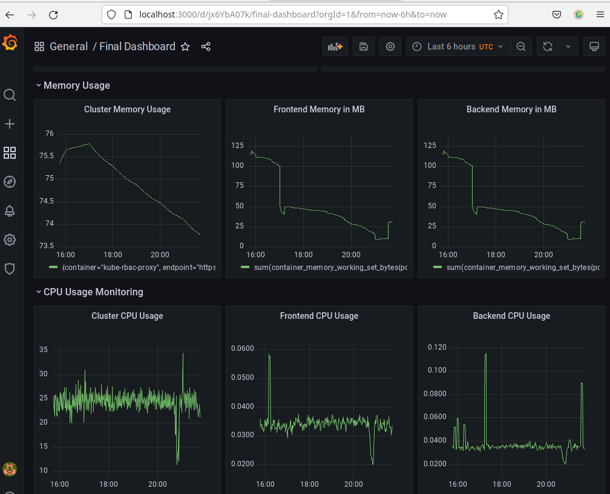

### Descriptions
1. The first row represents service uptime and HTTP 400 error rate.

2. The second row provides an overview of the service response time. The first graph of the row calculates the average response time over time frames of 15 minutes, the second graph over time frames of 1 minute.

3. The third row represents the memory usage of the cluster, of the backend service and of the frontend service.

4. The forth row represents the CPU usage of the cluster, of the backend service and of the frontend service. 
